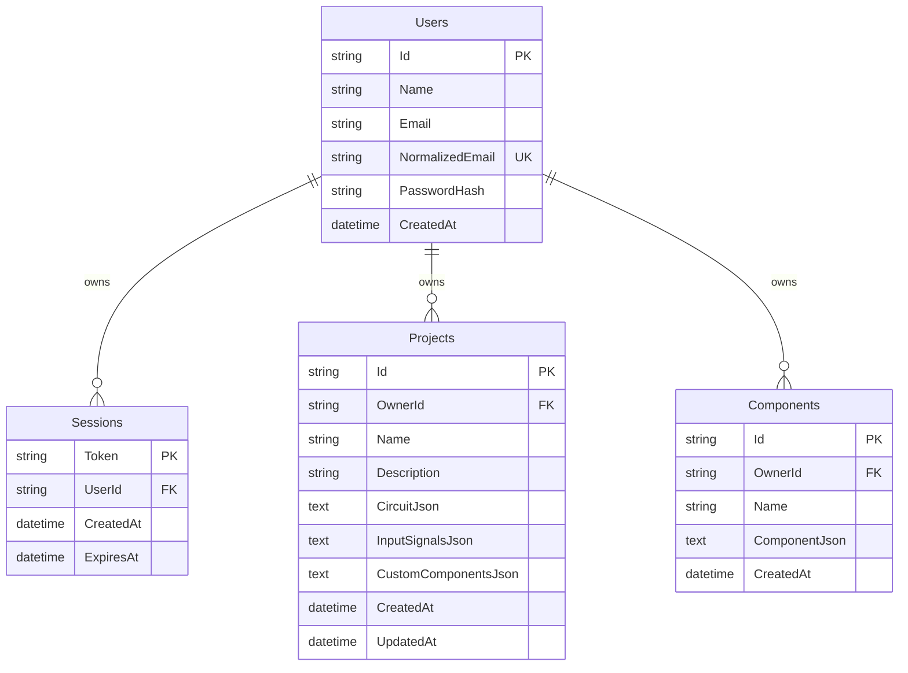

# Aktuelles Datenbankdesign

Stand: 2026-05-28

## Überblick

BitFlow speichert seine Backend-Daten mit Entity Framework Core 8 in einer SQLite-Datenbank. Die Datenbankverbindung wird über `ConnectionStrings:BitFlowDb` konfiguriert.

- Lokal: `Data/bitflow.db`
- Docker: `/app/Data/bitflow.db`, persistiert im Volume `bitflow-data`
- Schema-Erzeugung: beim Start per `Database.EnsureCreated()`
- Migrations: aktuell keine EF-Core-Migrationshistorie im Repository

Das Modell kombiniert relationale Account-/Besitzdaten mit JSON-Dokumenten für flexible Schaltungsdaten. Benutzer, Sessions, Projekte und globale benutzerdefinierte Bausteine sind eigene Tabellen. Gates, Wires, Netze und projektinterne Custom Components werden nicht relational normalisiert, sondern als JSON im Projekt gespeichert.

## ER-Modell

## Tabellen

### `Users`

Speichert registrierte Benutzerkonten.

| Spalte | Bedeutung | Constraints / Details |
| --- | --- | --- |
| `Id` | Primärschlüssel | `MaxLength(64)`, generiert als `user_<guid>` |
| `Name` | Anzeigename | required, `MaxLength(200)` |
| `Email` | E-Mail-Adresse wie eingegeben | required, `MaxLength(320)` |
| `NormalizedEmail` | normalisierte E-Mail für Login/Unique Check | required, `MaxLength(320)`, eindeutiger Index |
| `PasswordHash` | Passwort-Hash | required, PBKDF2-Format `pbkdf2:v1:<iterations>:<salt>:<hash>` |
| `CreatedAt` | Erstellzeitpunkt | `DateTimeOffset`, standardmäßig UTC |

Beziehungen:

- Ein Benutzer besitzt beliebig viele `Sessions`.
- Ein Benutzer besitzt beliebig viele `Projects`.
- Ein Benutzer besitzt beliebig viele `Components`.
- Beim Löschen eines Benutzers werden Sessions, Projekte und Komponenten per Cascade Delete entfernt.

### `Sessions`

Speichert serverseitige Login-Sessions. Der Token wird im Frontend als Bearer Token verwendet.

| Spalte | Bedeutung | Constraints / Details |
| --- | --- | --- |
| `Token` | Primärschlüssel und Session-Token | `MaxLength(96)`, generiert als `session_<random-hex>` |
| `UserId` | Besitzer der Session | FK auf `Users.Id`, `MaxLength(64)`, indexiert |
| `CreatedAt` | Erstellzeitpunkt | `DateTimeOffset`, standardmäßig UTC |
| `ExpiresAt` | Ablaufzeitpunkt | standardmäßig 14 Tage nach Erstellung |

Abgelaufene Sessions werden bei der Authentifizierung ignoriert. Ein automatischer Cleanup für abgelaufene Sessions ist aktuell nicht im Datenmodell bzw. Startup-Code erkennbar.

### `Projects`

Speichert Projekte eines Benutzers. Die eigentliche Schaltung liegt als JSON-Dokument vor.

| Spalte | Bedeutung | Constraints / Details |
| --- | --- | --- |
| `Id` | Primärschlüssel | `MaxLength(64)`, generiert als `project_<guid>` |
| `OwnerId` | Besitzer des Projekts | FK auf `Users.Id`, `MaxLength(64)` |
| `Name` | Projektname | required, `MaxLength(200)` |
| `Description` | Beschreibung | required, `MaxLength(1000)`, leerer String statt `null` |
| `CircuitJson` | Schaltungsdokument | required, JSON |
| `InputSignalsJson` | Simulations-/Input-Zustände | required, JSON-Objekt |
| `CustomComponentsJson` | projektinterne benutzerdefinierte Bausteine | required, JSON-Array |
| `CreatedAt` | Erstellzeitpunkt | `DateTimeOffset`, standardmäßig UTC |
| `UpdatedAt` | letzter Änderungszeitpunkt | `DateTimeOffset`, wird bei Updates gesetzt |

Indexe:

- `(OwnerId, UpdatedAt)` für Projektlisten pro Benutzer, sortiert nach Aktualität.

JSON-Inhalte:

- `CircuitJson`: enthält mindestens `id`, `name`, `version`, `gates`, `wires` und `customComponents`; optional auch `annotations` und `nets`.
- `InputSignalsJson`: entspricht einem Key-Value-Objekt `Record<string, boolean>`.
- `CustomComponentsJson`: Array von Custom-Component-Definitionen mit `id`, `name`, optionaler `description`, `inputLabels`, `outputLabels`, `truthTable`, optionaler `sourceCircuitId` und `createdAt`.

Beim Anlegen eines Projekts wird ein leeres Circuit-Dokument mit Version `1`, leeren Gate-/Wire-Arrays und leerer Custom-Component-Liste erzeugt, falls kein Circuit übergeben wird.

### `Components`

Speichert globale benutzerdefinierte Bausteine eines Benutzers unabhängig von einem konkreten Projekt.

| Spalte | Bedeutung | Constraints / Details |
| --- | --- | --- |
| `Id` | Primärschlüssel | `MaxLength(64)`, generiert als `component_<guid>` oder aus Payload übernommen |
| `OwnerId` | Besitzer des Bausteins | FK auf `Users.Id`, `MaxLength(64)` |
| `Name` | Bausteinname | required, `MaxLength(200)` |
| `ComponentJson` | vollständige Bausteindefinition | required, JSON |
| `CreatedAt` | Erstellzeitpunkt | `DateTimeOffset`, aus Payload oder UTC jetzt |

Indexe:

- `(OwnerId, Name)` für sortierte Bausteinlisten pro Benutzer.

`ComponentJson` entspricht der API-Struktur `CustomComponentDto`:

- `id`
- `name`
- `description`
- `inputLabels`
- `outputLabels`
- `truthTable` mit `inputs` und `outputs`
- `sourceCircuitId`
- `createdAt`

Es gibt aktuell keine relationale Fremdschlüsselbeziehung zwischen `Components` und `Projects`. Wenn ein Projekt einen benutzerdefinierten Baustein nutzt, wird dieser im Projekt-JSON bzw. Circuit-JSON mitgeführt.

## Beziehungen und Löschverhalten

| Beziehung | Kardinalität | Löschverhalten |
| --- | --- | --- |
| `Users` -> `Sessions` | 1:n | Cascade Delete |
| `Users` -> `Projects` | 1:n | Cascade Delete |
| `Users` -> `Components` | 1:n | Cascade Delete |

Projekte und Komponenten sind strikt benutzergebunden. Repository-Methoden suchen Projekte und Komponenten immer über Kombinationen aus `OwnerId` und Objekt-ID, wodurch fremde Datensätze auf Service-Ebene nicht geladen werden.

## Schlüssel und Indexe

| Tabelle | Primärschlüssel | Weitere Indexe |
| --- | --- | --- |
| `Users` | `Id` | unique `NormalizedEmail` |
| `Sessions` | `Token` | `UserId` |
| `Projects` | `Id` | `(OwnerId, UpdatedAt)` |
| `Components` | `Id` | `(OwnerId, Name)` |

Die IDs sind stringbasierte, präfixierte IDs. Das macht die Datensätze in Logs und API-Antworten leicht unterscheidbar, z. B. `user_...`, `project_...`, `component_...`, `circuit_...` und `session_...`.

## Design-Einordnung

Das aktuelle Design ist bewusst dokumentorientiert für Schaltungen:

- Relationale Tabellen sichern Benutzer, Besitz, Sessions und grobe Projekt-/Baustein-Metadaten.
- Flexible, häufig gemeinsam geladene Editor-Daten liegen als JSON vor.
- Dadurch sind Projekt-Load und Projekt-Save einfach, weil die Schaltung als ganzes Dokument verarbeitet wird.
- Die Datenbank kann dafür einzelne Gates, Wires, Pins oder Truth-Table-Zeilen nicht direkt per SQL validieren oder abfragen.
- Integrität innerhalb der JSON-Dokumente wird hauptsächlich durch Services, DTOs und Frontend-Typen abgesichert, nicht durch Datenbankconstraints.

## Relevante Codequellen

- `backend/BitFlow.API/Data/BitFlowDbContext.cs`
- `backend/BitFlow.API/Models/User.cs`
- `backend/BitFlow.API/Models/UserSession.cs`
- `backend/BitFlow.API/Models/Project.cs`
- `backend/BitFlow.API/Models/Component.cs`
- `backend/BitFlow.API/Services/ProjectService.cs`
- `backend/BitFlow.API/Services/ComponentService.cs`
- `backend/BitFlow.API/Services/UserService.cs`
- `frontend/src/types/circuit.ts`
- `docker-compose.yml`
