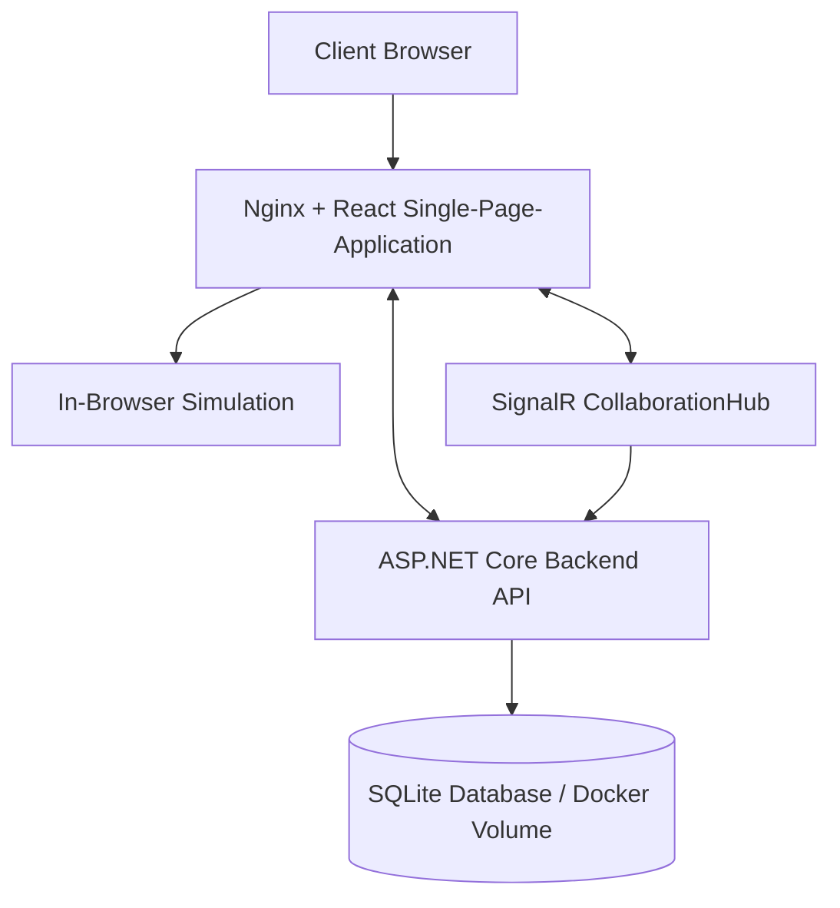
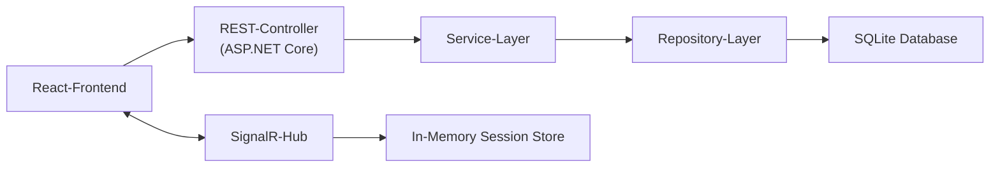

**Dokumentversion:** 1.2
**Stand:** 2026-06-01
**Status:** Aktualisiert auf den aktuellen Projektstand

# BitFlow
# Software Architecture Document

---

## Revision History

Date | Version | Description | Author
---- | ------- | ----------- | ------
<08/12/25> | <1.0> | Erstellung des Dokuments und erste Einträge | BitFlow-Team
<22/12/25> | <1.1> | Vollständige Ausfüllung | BitFlow-Team
<01/06/26> | <1.2> | Abgleich mit aktuellem Codebestand: Backend, SQLite, Vitest, SignalR-Kollaboration und tatsächlicher Custom-Component-Workflow | BitFlow-Team

---

# Table of Contents

1. Introduction

    1.1 Purpose
  
    1.2 Scope

    1.3 Definitions, Acronyms and Abbreviations

    1.4 References

    1.5 Overview

2. Architectural Representation

3. Architectural Goals and Constraints

4. Use-Case View

5. Logical View

    5.1 Overview
   
    5.2 Architecturally Significant Design Packages
  
    5.3 Use-Case Realizations

6. Process View

7. Deployment View

8. Implementation View

    8.1 Overview
   
    8.2 Layers

9. Data View (optional)

10. Size and Performance

11. Quality

---

# Software Architecture Document

## 1. Introduction

Dieses Dokument beschreibt die Software-Architektur von **BitFlow**, einem browserbasierten Logikschaltungs-Editor und -Simulator.
Die Architektur wird anhand des **4+1-Sichtenmodells nach Kruchten** dargestellt und fasst die wesentlichen Architekturentscheidungen, Qualitätsziele und Strukturen des Systems zusammen.

### 1.1 Purpose

Ziel dieses Dokuments ist es, die wesentlichen architektonischen Entscheidungen von BitFlow nachvollziehbar zu dokumentieren.
Es dient als gemeinsame Grundlage für Entwicklung, Bewertung und Weiterentwicklung des Systems und richtet sich an Entwickler, Projektbeteiligte und Lehrende.

### 1.2 Scope

Das Software Architecture Document gilt für das gesamte BitFlow-System, einschließlich:
- grafischem Editor für Logikschaltungen,
- Simulationslogik,
- Bausteinbibliothek (inkl. benutzerdefinierter Bausteine),
- Persistenzmechanismen,
- ASP.NET-Core-Backend für Benutzer-, Session-, Projekt- und Komponentendaten sowie
- SignalR-basierter Live-Kollaboration.

### 1.3 Definitions, Acronyms and Abbreviations

- **ASR**: Architecture Significant Requirement
- **UI**: User Interface
- **SPA**: Single Page Application
- **SRP**: Single Responsibility Principle

### 1.4 References

- [Software Requirements Specification (SRS)](https://github.com/BitFlow-DHBW/BitFlow/blob/main/docs/use_cases/software_requirements_specification.md)
- [Architecture Significant Requirements (ASR)](https://github.com/BitFlow-DHBW/BitFlow/blob/main/docs/Architecture%20Significant%20Requirements%20(ASR).md)
- [Vorlesungsunterlagen „Software Engineering“](https://moodle.dhbw.de/course/view.php?id=12128)

### 1.5 Overview

Das Dokument ist entsprechend dem Software Architecture Document aufgebaut und gliedert die Architektur von BitFlow in mehrere Sichten.
Neben funktionalen Aspekten werden insbesondere Qualitätsanforderungen, Laufzeitverhalten, Deployment sowie zentrale Entwurfsentscheidungen beschrieben.

---

## 2. Architectural Representation

Die Software-Architektur von BitFlow wird anhand des **4+1-Sichtenmodells nach Kruchten** beschrieben. Dieses Modell ermöglicht es, die Architektur aus verschiedenen Perspektiven darzustellen und sowohl funktionale als auch nicht-funktionale Anforderungen angemessen zu berücksichtigen.

Für BitFlow werden die folgenden Sichten verwendet:

- **Use-Case View:** Beschreibt die funktionalen Anforderungen des Systems aus Sicht der Benutzer und zeigt, welche Anwendungsfälle architektonisch relevant sind.
- **Logical View:** Stellt die statische Struktur des Systems dar, insbesondere Klassen, Pakete und deren Beziehungen.
- **Process View:** Beschreibt das Laufzeitverhalten, die Nebenläufigkeit sowie die Kommunikation zwischen den zentralen Komponenten.
- **Deployment View:** Zeigt die physische Verteilung der Software auf Hardware- und Laufzeitumgebungen.
- **Implementation View:** Beschreibt die Aufteilung des Systems in Komponenten, Module und Schichten.

Diese Sichten ergänzen sich gegenseitig und bilden gemeinsam eine konsistente Beschreibung der Gesamtarchitektur von BitFlow.

---

## 3. Architectural Goals and Constraints

Die Architektur von BitFlow wird durch mehrere qualitätsrelevante Anforderungen geprägt, die maßgeblich beeinflussen, wie das System strukturiert und entwickelt wird. Diese Architecture Significant Requirements (ASR) bestimmen insbesondere die Wahl der Module, Abhängigkeiten und Entwurfsmuster.

### 3.1 Wichtige Qualitätsziele (ASRs)

**Performance**
- Änderungen in Schaltungen bis ca. 200 Bausteinen müssen innerhalb von ≤ 50 ms verarbeitet werden.
- UI soll jederzeit flüssig bleiben (≥ 30 FPS), selbst während Simulation und Interaktionen.

**Usability**
- Drag & Drop und visuelle Interaktionen müssen ohne wahrnehmbare Verzögerungen funktionieren.
- Leitungszustände, Fehlermeldungen und Simulationsergebnisse sollen sofort angezeigt werden.

**Reliability**
- Undo/Redo muss stabil funktionieren und Systemzustände zuverlässig wiederherstellen.
- Manuelles Speichern über die Backend-API muss zuverlässig sein.
- Ungespeicherte Änderungen müssen beim Verlassen des Editors abgefangen werden.
- Fehler in Simulation oder Bausteinen dürfen die UI nicht blockieren.

**Modifiability**
- Neue Bausteine (benutzerdefiniert oder systemseitig) sollen einfach integrierbar sein.
- Simulation, Speichermechanismen und Validierungsstrategien müssen austauschbar sein.
- Module sollen klar gekapselt und unabhängig voneinander testbar sein.

**Security**
- Nur authentifizierte Nutzer dürfen Projekte anzeigen oder bearbeiten.
- Projekte müssen eindeutig einem Benutzer zugeordnet werden.
- Session-Tokens müssen serverseitig geprüft und zeitlich begrenzt sein.

**Availability**
- UI muss verfügbar bleiben, selbst wenn eine Schaltung fehlerhaft oder komplex ist.
- Live-Kollaborationssessions müssen kontrolliert beendet werden, wenn der Host die Session verlässt.

---

### 3.2 Zentrale Architekturentscheidungen

- Strikte Trennung der Kernbereiche: **UI**, **Frontend-Services**, **Domain/Simulation**, **Backend-API**, **Storage**, **Library** und **Realtime Collaboration**.
- Simulation läuft aktuell im Frontend über `evaluateCircuit` mit begrenzten Iterationen; WebWorker sind architektonisch möglich, aber nicht umgesetzt.
- Alle Bausteintypen basieren auf einheitlichen abstrakten Interfaces.
- Undo/Redo wird über Zustandssnapshots realisiert, nicht über Kommandohistorien.
- Benutzerdefinierte Bausteine werden aus der aktuellen Schaltung als Wahrheitstabelle erzeugt.
- UI kommuniziert ausschließlich über Services und nicht direkt mit der Domain.

---

### 3.3 Technische Randbedingungen

- Frontend muss im Browser lauffähig sein (React + TypeScript).
- Backend läuft als ASP.NET-Core-8-Web-API mit SQLite-Persistenz.
- Keine Plugins oder native Komponenten; nur Web-Standards.
- Persistenz erfolgt über Backend-APIs; LocalStorage wird für Sessiondaten, Präferenzen und UI-Zustände genutzt.
- Zielplattformen: Chrome, Firefox, Safari, Edge.
- Simulation muss deterministisch sein, um Debugging und Testbarkeit sicherzustellen.
---

## 4. Use-Case View

Der Use-Case View beschreibt die funktionalen Anforderungen von BitFlow aus Sicht der Benutzer und zeigt, welche Anwendungsfälle architektonisch besonders relevant sind. Die folgenden Use Cases decken die Kernfunktionalität des Systems ab und beeinflussen mehrere Architekturkomponenten gleichzeitig.

### Architektonisch signifikante Use Cases

- **Schaltung erstellen und bearbeiten**
  Benutzer platzieren Bausteine per Drag & Drop, verbinden diese über Leitungen und konfigurieren Eingänge. Dieser Use Case betrifft UI, Domain-Modell und Validierungslogik.

- **Simulation starten und ausführen**
  Die erstellte Schaltung wird in Echtzeit simuliert. Dieser Use Case ist zentral für Performance- und Availability-Anforderungen und erfordert eine klare Trennung zwischen UI und Simulation.

- **Benutzerdefinierte Bausteine erstellen**
  Benutzer fassen die aktuelle Schaltung zu einem neuen Baustein zusammen. Dieser Use Case beeinflusst die Bausteinbibliothek, die Wahrheitstabellenerzeugung und die Modifiability der Architektur.

- **Undo / Redo von Aktionen**
  Benutzer können Bearbeitungsschritte rückgängig machen oder wiederherstellen. Dieser Use Case ist architektonisch relevant für Reliability und Konsistenz des Systemzustands.

- **Projekt speichern und laden**
  Schaltungen werden persistent gespeichert und wiederhergestellt. Dieser Use Case betrifft Storage, Datenmodell und Schnittstellen zwischen Frontend und Persistenz.

- **Live-Kollaboration starten und beitreten**
  Benutzer erstellen SignalR-Sessions, teilen Einladungslinks und synchronisieren Schaltungszustände sowie Cursorpositionen. Dieser Use Case betrifft Realtime-Kommunikation, Session-Verwaltung und Speichern-Rechte.

---

## 5. Logical View

Der Logical View beschreibt die statische Struktur des Systems und zeigt, wie die Software in logisch zusammenhängende Pakete und Klassen zerlegt ist. Der Fokus liegt auf den architektonisch signifikanten Teilen des Designmodells und deren Verantwortlichkeiten.

### 5.1 Overview

Das logische Modell von BitFlow ist in mehrere klar abgegrenzte Bereiche unterteilt, die den zentralen Verantwortlichkeiten des Systems entsprechen. Die Architektur folgt dem Prinzip der **Separation of Concerns** und orientiert sich an einer schichtenähnlichen Struktur.

Die wichtigsten logischen Bereiche sind:
- **UI-nahe Komponenten** für Benutzerinteraktion,
- **Frontend-Services** zur Kommunikation mit Backend, LocalStorage und SignalR,
- **Backend-Services** zur Orchestrierung von Authentifizierung, Projekten, Komponenten und Kollaboration,
- **Domain-Modelle** zur Abbildung von Schaltungen und Bausteinen,
- **Simulation** zur Berechnung von Signalzuständen,
- **Persistenz- und Bibliothekskomponenten** für Speicherung und Wiederverwendung.

Abhängigkeiten verlaufen dabei ausschließlich von höher- zu niedrigerliegenden Abstraktionsebenen.

---

### 5.2 Architecturally Significant Design Packages

#### UI Package
- **Beschreibung:** Enthält alle Klassen zur Darstellung und Interaktion mit dem Benutzer.
- **Beispiele:** `EditorView`, `Canvas`, `Toolbar`
- **Verantwortlichkeiten:** Darstellung, Benutzerinteraktion, Weiterleitung von Aktionen an Application Services.

#### Application Package
- **Beschreibung:** Vermittelt zwischen UI, Backend-API, LocalStorage und Collaboration-Hub.
- **Beispiele:** `projectService`, `authService`, `preferencesService`, `collaborationService`, `useHistory`
- **Verantwortlichkeiten:** Use-Case-Steuerung, API-Kommunikation, Sessionverwaltung, lokale Präferenzen und Undo/Redo.

#### Domain Package
- **Beschreibung:** Zentrales Fachmodell von BitFlow.
- **Beispiele:** `Circuit`, `Gate`, `CustomComponent`, `Wire`, `Pin`, `Net`, `Annotation`
- **Verantwortlichkeiten:** Repräsentation der Schaltung, Struktur, Konsistenzregeln.

#### Simulation Package
- **Beschreibung:** Kapselt die Simulationslogik.
- **Beispiele:** `evaluateCircuit`, `gateLibrary`, `customComponentFactory`, `netModel`, `wireUtils`
- **Verantwortlichkeiten:** Berechnung von Signalzuständen, Gatterdefinitionen, Netzerzeugung und Wahrheitstabellenerzeugung.

#### Library Package
- **Beschreibung:** Zentrale Registry für verfügbare Bausteine.
- **Beispiele:** `GATE_TEMPLATES`, `createGate`, `createCustomGate`, `CustomComponentDialog`, `CustomComponentImportDialog`
- **Verantwortlichkeiten:** Verwaltung und Erzeugung von Standard- und benutzerdefinierten Bausteinen.

#### Storage Package
- **Beschreibung:** Abstraktion der Persistenzmechanismen.
- **Beispiele:** `ProjectController`, `ProjectService`, `ProjectRepository`, `BitFlowDbContext`, `localStorage`
- **Verantwortlichkeiten:** Speichern, Laden und Löschen von Projekten, Benutzer- und Komponentendaten sowie lokale UI-Präferenzen.

#### Realtime Package
- **Beschreibung:** Kapselt Live-Kollaboration.
- **Beispiele:** `CollaborationHub`, `CollaborationSessionStore`, `CollaborationClient`, `useCollaborationSession`
- **Verantwortlichkeiten:** Session-Erstellung, Beitritt, Teilnehmerstatus, Cursorupdates und Schaltungssynchronisation.

---

### 5.3 Use-Case Realizations

Die Realisierung der Use Cases erfolgt über Application Services, die als zentrale Einstiegspunkte dienen.
Beispielsweise wird der Use Case *„Simulation starten“* wie folgt umgesetzt:

1. UI löst Aktion über einen Application Service aus.
2. Service validiert den aktuellen Schaltungszustand.
3. Simulation Engine wird initialisiert und gestartet.
4. Zustandsänderungen werden über Observer an die UI zurückgemeldet.

Dieses Vorgehen stellt sicher, dass UI, Domain und Simulation lose gekoppelt bleiben und unabhängig weiterentwickelt werden können.

---

## 6. Process View

Die Process View beschreibt die Laufzeitarchitektur von BitFlow, insbesondere Threads, asynchrone Abläufe und Interaktionen zwischen UI und Simulation. Sequenzdiagramme sind in den einzelnen [Use-Cases](https://github.com/BitFlow-DHBW/BitFlow/blob/main/docs/use_cases/software_requirements_specification.md#3-specific-requirements) zu finden.

### 6.1 Hauptprozesse

1. UI-Thread (Browser Hauptthread)
- Rendern des Editors und der Bauteine
- Drag & Drop
- Leitungsvisualisierung
- Undo/Redo
- Kommunikation mit Simulation und Storage
- Fehleranzeigen und Nutzerinteraktion
Der UI-Thread darf nie blockiert werden, daher laufen schwere Berechnungen woanders.

2. Simulationslogik im Frontend
- Berechnet Signalflüsse über `evaluateCircuit`
- nutzt Netze und Pin-Gruppen aus `wireUtils` und `netModel`
- unterstützt kombinatorische Gatter, Flip-Flops, generische Wahrheitstabellen und Custom Components
- begrenzt Iterationen abhängig von der Schaltungsgröße
Ein separater WebWorker ist aktuell nicht implementiert.

3. Speicherprozess (benutzergesteuert, asynchron)
- Speichert auf Klick oder vor Navigation nach Bestätigung
- sendet Projekt, Schaltung, Input-Signale, Netze und Custom Components über `PUT /api/projects/{id}`
- markiert den Editorzustand als „Gespeichert“ oder „Speichern fehlgeschlagen“

4. Custom-Component-Erzeugung
- liest Eingangs- und Ausgangsgatter der aktuellen Schaltung
- erzeugt eine Wahrheitstabelle durch Simulation aller Eingangskombinationen
- fügt den Baustein zur Projektbibliothek hinzu

5. Kollaborationsprozess
- erstellt und verwaltet SignalR-Sessions
- überträgt Schaltungsstände und Cursorpositionen
- beendet Sessions, wenn der Host die Session verlässt

### 6.2 Kommunikationsmodell

- React-State und Hooks für UI- und Simulationszustände.
- HTTP/JSON zwischen Frontend-Service und ASP.NET-Core-API.
- SignalR/WebSocket-Fallbacks für Collaboration-Events.
- Asynchrone Aufrufe an Storage- und Collaboration-Services.

---

## 7. Deployment View

Der Deployment View beschreibt die physische Verteilung der Softwarekomponenten von BitFlow auf die beteiligten Laufzeitumgebungen sowie deren Kommunikation untereinander. BitFlow ist als browserbasierte Webanwendung konzipiert und benötigt keine lokale Installation.

### 7.1 Deployment Diagram

### 7.2 Beschreibung

- Die Benutzeroberfläche wird als Single Page Application im Browser ausgeführt.
- Die Simulationslogik läuft aktuell im Browser und ist in eigene Frontend-Module gekapselt.
- Das Backend stellt Funktionen für Authentifizierung, Benutzerverwaltung, Projektpersistenz und Komponenten bereit.
- Die Datenbank speichert Benutzerkonten, Sessions, Projektinformationen und globale benutzerdefinierte Bausteine.
- Live-Kollaboration läuft über den SignalR-Hub; Collaboration-Sessions werden zur Laufzeit im Speicher gehalten.
- Die Kommunikation zwischen Frontend und Backend erfolgt über HTTP-basierte Schnittstellen.
- In Docker leitet Nginx `/api/` und `/hubs/` an den Backend-Container weiter.

Diese Deployment-Struktur unterstützt insbesondere die Anforderungen an **Performance**, **Availability** und **Portability**.

---

## 8. Implementation View

### 8.1 Overview

Die Implementierung ist in klar getrennte Schichten gegliedert, die Änderungen erleichtern, Testbarkeit erhöhen und die Simulation isolieren:
- UI Layer (React/TypeScript)
- Frontend Service Layer (API, Auth, Projekte, Kollaboration, Präferenzen)
- Domain Layer (Simulation, Schaltung, Bausteine, Netze)
- Library Layer (Standard- & Custom-Bausteine)
- Backend API Layer (Controller, Services, Repositories)
- Storage Layer (SQLite/EF Core und LocalStorage für Client-Präferenzen)
- Realtime Layer (SignalR)
- Diese Layer kommunizieren nur über definierte Schnittstellen.

### 8.2 Layers

1. UI Layer
- Beinhaltet:
- Editor-Canvas
- Bibliothek/Panel-Dock/Floating-Panels
- Inspector
- SimulationPanel und SignalViewer
- CollaborationPanel
- UnsavedChangesDialog
- Undo/Redo UI

2. Domain Layer

- Gate
- Wire
- Circuit
- Net
- CustomComponent
- Annotation
- evaluateCircuit
- customComponentFactory

Umfasst die eigentliche Logik.

3. Library Layer

- Vordefinierte Gatter (AND, OR, NOT etc.)
- Benutzerdefinierte Bausteine
- Factory Pattern zur Erzeugung

4. Backend API Layer

- AuthController/UserController
- ProjectController
- ComponentController
- UserService, ProjectService, ComponentService
- Repositories

5. Storage Layer

- SQLite über Entity Framework Core
- JSON-Dokumente für Schaltungen, Input-Signale und Custom Components
- LocalStorage für Sessiondaten, Präferenzen und Panel-Zustände

6. Realtime Layer

- CollaborationHub
- CollaborationSessionStore
- SignalR-Client im Frontend
---

### 8.3 Layer Kommunikation

---

## 9. Data View

BitFlow verwendet persistente Speicherung zur Ablage von Benutzerprojekten und zugehörigen Metadaten. Die Datenhaltung ist bewusst einfach gehalten und folgt der logischen Struktur der Domänenobjekte.

### 9.1 Persistente Daten

- **User**
  - user_id
  - name
  - email
  - normalized_email
  - password_hash

- **Session**
  - token
  - user_id
  - created_at
  - expires_at

- **Project**
  - project_id
  - owner_id
  - name
  - description
  - circuit_json
  - input_signals_json
  - custom_components_json
  - created_at
  - last_modified

- **ComponentDefinition**
  - component_id
  - owner_id
  - name
  - component_json
  - created_at

### 9.2 Beschreibung

- Projekte und Schaltungen werden strukturiert serialisiert gespeichert.
- Benutzerdefinierte Bausteine werden als eigene Definitionen persistiert.
- Projektinterne Schaltungsdaten liegen als JSON im Projekt.
- Globale benutzerdefinierte Bausteine liegen in der Tabelle `Components`.
- Das Circuit-JSON enthält eine `version`; ein automatisches Autosave/Recovery ist aktuell nicht implementiert.

Dieses Datenmodell unterstützt die Anforderungen an **Reliability** und **Modifiability**.

---

## 10. Size and Performance

Die Architektur von BitFlow ist darauf ausgelegt, auch bei steigender Komplexität der Schaltungen eine gute Performance und Benutzererfahrung sicherzustellen.

### Größenannahmen

- Typische Schaltungen bestehen aus bis zu 50 Bausteinen.
- Ein Projekt kann mehrere Schaltungen enthalten.
- Die Bausteinbibliothek kann durch benutzerdefinierte Bausteine erweitert werden.

### Performance-Aspekte

- Die Simulation wird ereignisgesteuert ausgeführt, sodass nur relevante Signaländerungen neu berechnet werden.
- UI-Aktualisierungen erfolgen gebündelt, um unnötige Re-Renders zu vermeiden.
- Rechenintensive Aufgaben sind von der Benutzeroberfläche getrennt.
- Die Architektur erlaubt eine schrittweise Optimierung der Simulation ohne Änderungen am UI.

### Einfluss auf Architekturentscheidungen

- Trennung von Simulation und UI zur Vermeidung von Blockaden.
- Verwendung klarer Schnittstellen zur besseren Austauschbarkeit von Komponenten.
- Begrenzung direkter Abhängigkeiten zur Sicherstellung der Skalierbarkeit.

Diese Maßnahmen unterstützen die definierten Performance-Ziele und tragen zu einer stabilen Systemgröße bei.

---

## 11. Quality

Hier werden die wichtigsten Architekturtaktiken zusammengefasst, die BitFlow nutzt, um die Anforderungen aus den ASRs zu erfüllen.

1. Modifiability

- Klare Trennung von UI, Domain, Storage, Simulation.
- Bausteine als austauschbare Komponenten mit einheitlicher Schnittstelle.
- Wahrheitstabellenerzeugung erlaubt neue benutzerdefinierte Bausteine.
- Information Hiding schützt interne Details.

2. Performance

- Deterministische In-Browser-Simulation mit begrenzten Iterationen.
- Batch-Updates im UI statt Einzelupdates.
- Asynchrone Backend- und SignalR-Kommunikation.

3. Usability

- Sofortiges visuelles Feedback bei Interaktionen.
- Farbliche Darstellung von Signalzuständen.
- Undo/Redo mit Snapshot-Technik.

4. Testability

- Modulare Architektur (SRP).
- Simulation, Storage und Collaboration-Client sind über klar getrennte Module testbar.
- Deterministische Simulation erlaubt reproduzierbare Tests.
- Klare API-Grenze zwischen UI und Domain.

5. Reliability

- Validierung vor Simulation.
- Fehlerbehandlung ohne UI-Stillstand.
- Navigationsschutz bei ungespeicherten Änderungen.
- Servervalidierung für Authentifizierung, Projektbesitz und JSON-Payloads.

