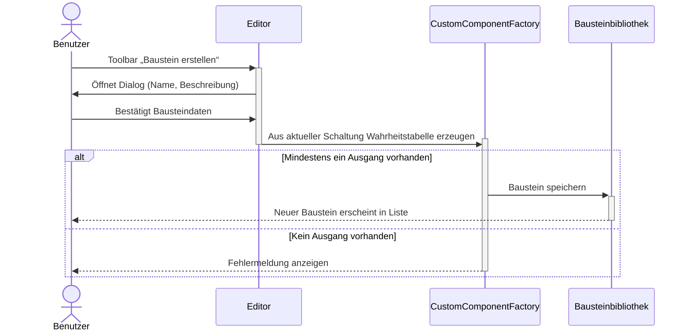

# BitFlow - Use-Case: Benutzerdefinierte Logikbausteine erstellen

## Table of Contents
- [BitFlow - Use-Case: Benutzerdefinierte Logikbausteine erstellen](#bitflow---use-case-benutzerdefinierte-logikbausteine-erstellen)
  - [Table of Contents](#table-of-contents)
  - [1. Introduction](#1-introduction)
    - [1.1 Purpose](#11-purpose)
    - [1.2 Scope](#12-scope)
    - [1.3 Definitions, Acronyms, and Abbreviations](#13-definitions-acronyms-and-abbreviations)
    - [1.4 References](#14-references)
    - [1.5 Overview](#15-overview)
  - [2. Flow of Events-Design](#2-flow-of-eventsdesign)
  - [3. Derived Requirements](#3-derived-requirements)

## 1. Introduction

### 1.1 Purpose
Dieses Dokument beschreibt die Realisierung des Use-Cases **„Benutzerdefinierte Logikbausteine erstellen“** im Rahmen des Projekts **BitFlow**. Ziel ist es, die technische Umsetzung und Interaktion der beteiligten Objekte (Editor, CustomComponentFactory, Projektbibliothek und Backend-Persistenz) zu dokumentieren.

### 1.2 Scope
Der Use-Case bezieht sich auf die Funktionalität, mit der Benutzer aus der aktuell geöffneten Schaltung einen wiederverwendbaren Baustein erzeugen können. Die Anwendung leitet Eingänge aus `INPUT`-Gattern und Ausgänge aus `OUTPUT`-Gattern ab, berechnet daraus eine Wahrheitstabelle und fügt den Baustein zur Projektbibliothek hinzu. Ein separater Code-Compiler ist im aktuellen Projektstand nicht vorhanden.

### 1.3 Definitions, Acronyms, and Abbreviations
- **Baustein**: Ein logisches Modul mit definierten Eingängen, Ausgängen und Verhalten.
- **Wahrheitstabelle**: Automatisch erzeugte Tabelle, die alle Eingabekombinationen und Ausgabewerte der Schaltung beschreibt.
- **Bibliothek**: Sammlung aller verfügbaren Logikbausteine im System.
- **Editor**: UI-Komponente zur Erstellung und Bearbeitung von Schaltungen.
- **CustomComponentFactory**: Frontend-Modul, das Ein-/Ausgangslabels und Wahrheitstabellen für neue Bausteine erzeugt.

### 1.4 References
- [BitFlow Software Requirements Specification (SRS), Abschnitt 3.1.9](https://github.com/BitFlow-DHBW/BitFlow/blob/main/docs/use_cases/software_requirements_specification.md#319-uc-09--benutzerdefinierte-logikbausteine-erstellen)
- Projekt-Mockups: [Benutzerdefinierte Logikbausteine erstellen](https://github.com/BitFlow-DHBW/BitFlow/blob/main/docs/mockups/Projekt%20bearbeiten%20Benutzerdefinierte%20Bausteine.png)

### 1.5 Overview
Kapitel 2 beschreibt die technische Realisierung des Use-Cases in Form einer textuellen Beschreibung und eines Sequenzdiagramms. Kapitel 3 enthält abgeleitete Anforderungen und Hinweise für die Implementierung.

## 2. Flow of Events-Design

### 2.1 Überblick
Der Use-Case wird durch den Benutzer über die Toolbar-Aktion **„Baustein erstellen“** gestartet. Das System öffnet einen Dialog, in dem Name und Beschreibung gepflegt werden. Die Logik wird nicht manuell programmiert, sondern aus der aktuellen Schaltung simuliert und als Wahrheitstabelle gespeichert.

### 2.2 Beteiligte Objekte
- **Benutzer:**  initiiert den Prozess und definiert den Baustein.
- **CustomComponentDialog:**  UI-Komponente zur Eingabe von Name und Beschreibung.
- **CustomComponentFactory:**  ermittelt Ein-/Ausgänge und erzeugt die Wahrheitstabelle.
- **Bausteinbibliothek:**  speichert und verwaltet die im Projekt verfügbaren eigenen Bausteine.
- **ProjectService / Backend:**  persistiert Projektzustand und Custom Components beim Speichern des Projekts.

### 2.3 Ablaufbeschreibung
1. **Benutzer:** Der Benutzer wählt in der Toolbar **„Baustein erstellen“**.
2. **Editor:** Das System öffnet den Dialog „Schaltung als Baustein speichern“.
3. **System:** Die Anwendung liest `INPUT`- und `OUTPUT`-Gatter der aktuellen Schaltung.
4. **Benutzer:** Der Benutzer vergibt Name und optional eine Beschreibung.
5. **CustomComponentFactory:** Für alle Eingangskombinationen wird die Schaltung ausgewertet und eine Wahrheitstabelle erzeugt.
6. **Bibliothek:** Der neue Baustein wird zur aktuellen Projektbibliothek hinzugefügt.
7. **Persistenz:** Beim Speichern des Projekts werden Schaltung und Custom Components über `PUT /api/projects/{id}` in SQLite gesichert.

### 2.4 Sequenzdiagramm

### 2.5 Zusammenhang der Komponenten

- Der `CustomComponentDialog` fungiert als Vermittler zwischen Benutzerinteraktion und Bausteinerzeugung.
- Die `CustomComponentFactory` übernimmt die Ableitung von Pins und Wahrheitstabelle.
- Die Bibliothek hält eigene Bausteine im aktuellen Editorzustand vor.
- Die Persistenz erfolgt zusammen mit dem Projekt über die Backend-API.

## 3. Derived Requirements
- **Fehlerbehandlung:**
Das System muss den Benutzer informieren, wenn aus der aktuellen Schaltung kein Baustein erzeugt werden kann, z. B. weil kein Ausgang vorhanden ist.

- **Validierung:**
Name, Beschreibung und abgeleitete Ein-/Ausgänge müssen vor dem Speichern konsistent sein.

- **Persistenz:**
Benutzerdefinierte Bausteine müssen im Projekt gespeichert und beim Laden des Projekts wiederhergestellt werden können.

- **Performance:**
Die Erzeugung der Wahrheitstabelle sollte bei typischen Schaltungen ohne wahrnehmbare Verzögerung erfolgen.

- **Benutzerfreundlichkeit:**
Der Editor soll eine visuelle Rückmeldung geben, wenn der Baustein erzeugt wurde oder wenn das Speichern wegen fehlender Ausgänge nicht möglich ist.
